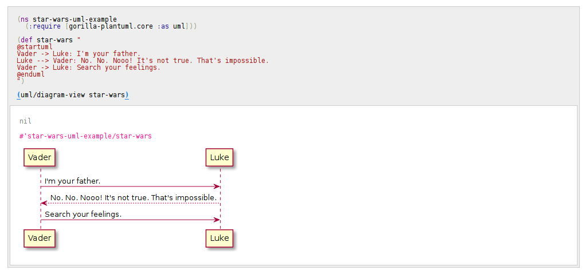

# gorilla-plantuml
[PlantUML](http://plantuml.com/) integration to [Gorilla REPL](http://gorilla-repl.org/).


[](https://clojars.org/org.clojars.vaclavsynacek/gorilla-plantuml)


# Usage

You can either clone this repo, see the example and build on that; or add this as a dependency to existing Gorilla REPL project.

## Clonning and example

```bash
git clone https://github.com/VaclavSynacek/gorilla-plantuml.git
cd gorilla-plantuml
lein gorilla :port 8080
open http://localhost:8080/worksheet.html?filename=example.clj
```

then hit shift+enter to reevaluate example and if that works modify the example and keep playing.

## Adding to Gorilla REPL Project

Your project should have at least `lein-gorilla` in plugins and `gorilla-plantuml` in dependencies, so minimal `project.clj` looks like:

```clojure
(defproject your-project "0.1.0-SNAPSHOT"
  :description "FIXME: write description"
  :url "http://example.com/FIXME"
  :license {:name "Eclipse Public License"
            :url "http://www.eclipse.org/legal/epl-v10.html"}
  :dependencies [[org.clojure/clojure "1.8.0"]
                 [org.clojars.vaclavsynacek/gorilla-plantuml "0.1.0-SNAPSHOT"]]
  :plugins [[lein-gorilla "0.4.0"]]
  :main ^:skip-aot test.core
  :target-path "target/%s"
  :profiles {:uberjar {:aot :all}})
```

Then run `lein gorilla` and navigate to REPL URL. Once in a worksheet require `gorilla-plantuml.core` namespace and call `diagram-view` function to display digram. For example:


